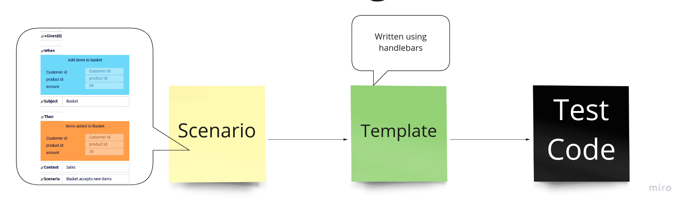
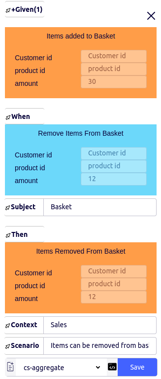
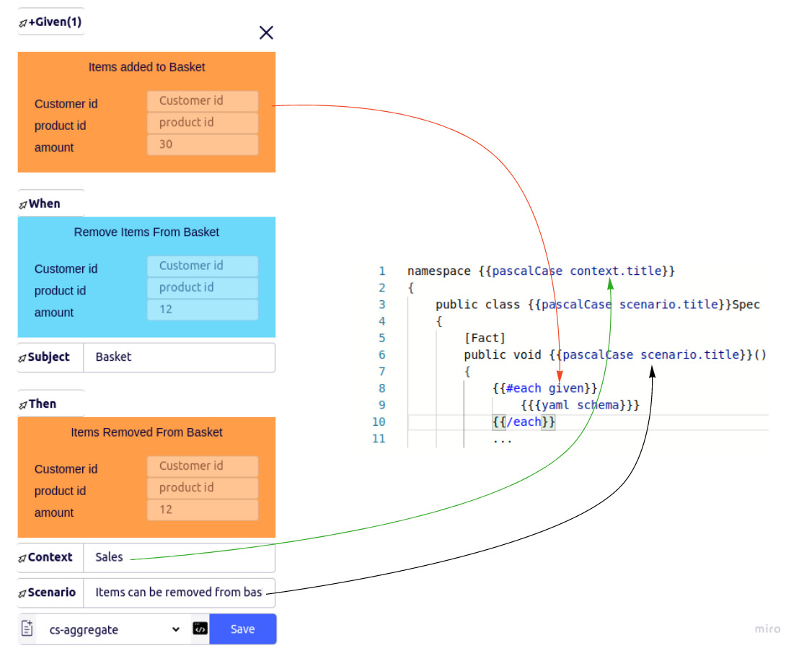
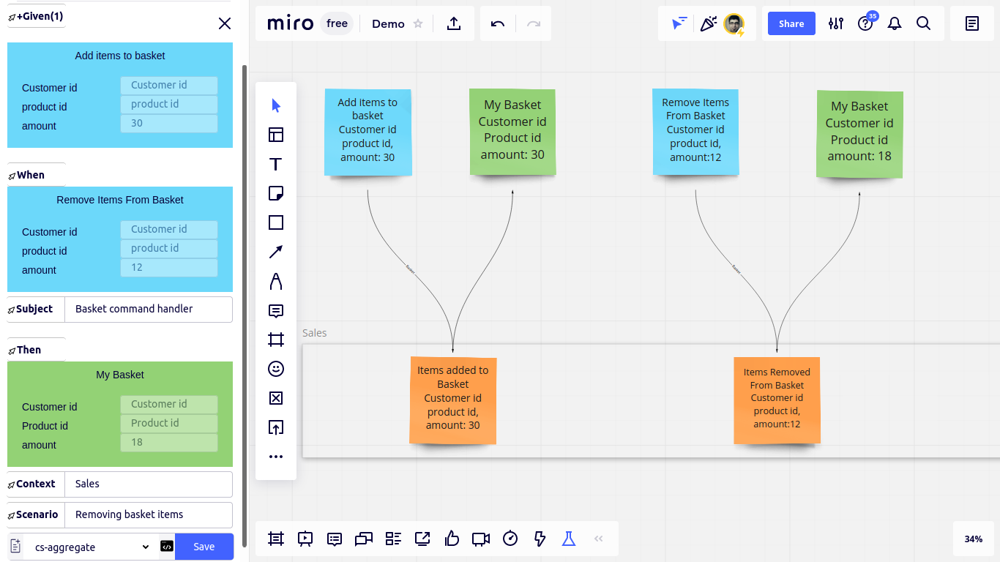
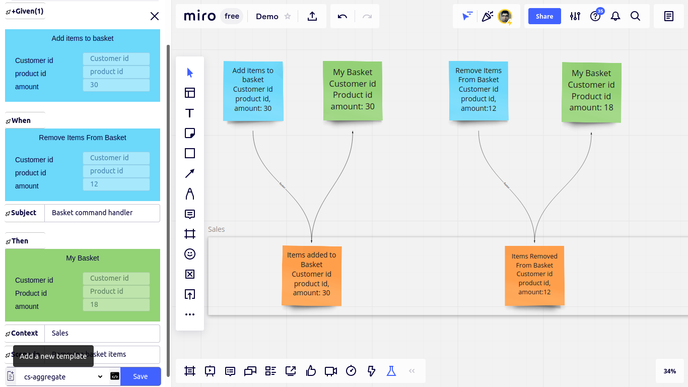
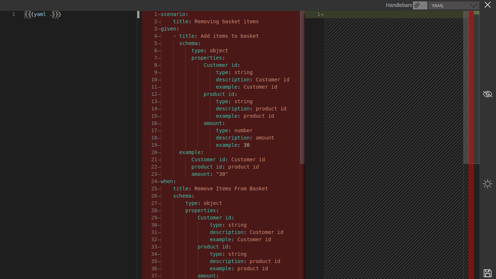

## Building a Template


A Template like a view in MVC pattern, accepts a model to generate code.

This is an example of a template
````handlebars
    namespace {{pascalCase context.title}}
    {
        public class {{pascalCase scenario.title}}Spec
        {
            [Fact]
            public void {{pascalCase scenario.title}}()
            {
                {{#each given}}
                ...
````

What happens when we pass the following scenario to the template above?



This is what happens:



## How to build a template?

It's best to start building a template by hunting a real scenario, and writing the test code we expect to be generated for it. 

Imagine the following scenario.



Let's say we expect the new template to generate the following gherkin

````gherkin
Scenario Outline: removing basket items
Given add items to basket 
        | customer id      | Customer id      |
        | product id       | product id       |
        | amount           | 30               |
When  remove items from basket 
        | customer id      | Customer id      |
        | product id       | product id       |
        | amount           | 12               |
Then  my basket 
        | customer id      | Customer id      |
        | product id       | Product id       |
        | amount           | 18               |
````

Let's click on new template button



To open template studio on our browser



The default template when we open the template studio is a `yaml` function with `.` (the model of the scenario we've hunted) as it's parameter. The generated yaml representation of the scenario specification, can be seen in the preview section of the template studio.


Template studio has three section. Template

After building and passing it, it's the time to write the template that generates the expected test. 

Img

Let's copy the expected output to the expectation section

Img

Then copy the expected test to the template section

Img

Now we gradually replace the constants with the variable parameters that will be filled with values from templates that will be hunted later. 
