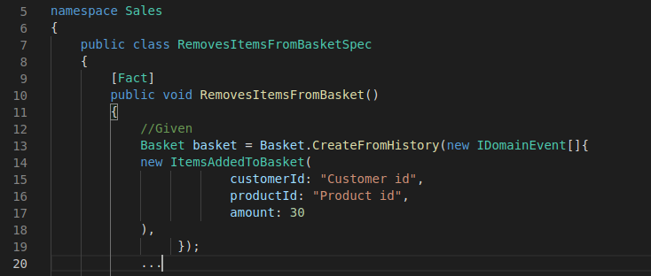

## Building a Template


A Template like a view in MVC pattern, accepts a model to generate code.

This is an example of a template
````handlebars
    namespace {{pascalCase context.title}}
    {
        public class {{pascalCase scenario.title}}Spec
        {
            [Fact]
            public void {{pascalCase scenario.title}}()
            {
                {{#each given}}
                ...
````

What happens when we pass the following abstract scenario to the template above?


This is what happens:


By passing the parameters from the abstract scenario to the template, a tiny pice of clean test code gets generated.



## How to build a template?

It's best to start building a template by hunting a real scenario, then clearly write the actual test code we expect to be generated for the hunted scenario. Let's do it.

Imagine the following scenario.

<!-- tabs:start -->
<!-- tab:Event Storming -->

<!-- tab:Event Modeling -->

<!-- tabs:end -->

Let's say we expect the new template to generate the following gherkin

````gherkin
Scenario Outline: removing basket items
Given add items to basket 
        | customer id      | Customer id      |
        | product id       | product id       |
        | amount           | 30               |
When  remove items from basket 
        | customer id      | Customer id      |
        | product id       | product id       |
        | amount           | 12               |
Then  my basket 
        | customer id      | Customer id      |
        | product id       | Product id       |
        | amount           | 18               |
````

Let's click on new template button

<!-- tabs:start -->
<!-- tab:Event Storming -->

<!-- tab:Event Modeling -->

<!-- tabs:end -->

To open template studio inside our browser window.


The default template when we open the template studio is `{{{yaml .}}}`. It's a `yaml` function with `.` (the model of the scenario we've hunted) as it's parameter. The generated yaml representation of the scenario specification, can be seen in the preview section of the template studio. 


!> Handlebars compiles only the code that is `{{inside of the blocks}}`. If we write a text outside of Handlebars' blocks, the exact same text appears in the preview pane.

Template studio has three panes:
- The `template pane` is on the left.
- The `preview pane` is in the middle.
- The `expected preview pane` is on the right.

Let's copy the gherkin we expect to be generated for this scenario and paste it to the expected preview pane.


Template studio automatically shows the difference between the actual preview of the template and the expected preview. The red color of the preview pane is telling us that the preview is totally different from what we expect.

To fix it, we copy the expected preview and paste it as a template to the template pane.


By pasting it the preview pane get's updated. All of the three panes show the identical text now.
No red highlights by the diff tool anymore, but if we save the template and hunt another scenario, it generates the gherkin for this scenario. It means that there are some constants we should replace with variable parameters from the scenario model.

Let's start by replacing the title of the scenario outline. 


It's telling us that the title of the scenario is expected to be lower case, but the template preview shows us the camel case version of the scenario title. So let's fix both expected scenario title. 

To be specific about the title of the scenario we pass it to the `sentenceCase` builtin function.


And the preview and the expected preview are the same again. The templating language is [handlebars](https://handlebarsjs.com/).
 Handlebars is mostly used for generating html views in MVC implementations. 
 
 To continue building the template we follow the [handlebar's documentation](https://handlebarsjs.com/). And this is the final gherkin template.

 ````handlebars
 Scenario Outline: {{spaceCase scenario.title}}
Given {{#each given as |step index|}}{{spaceCase step.title}} {{>table object=step.schema}}
{{#unless @last}} And {{/unless}}{{/each}}When {{#with when as |step|}} {{spaceCase step.title}} {{>table object=step.schema}}
{{/with}}
Then {{#each then as |step|}} {{spaceCase step.title}} {{>table object=step.schema}}
{{#unless @last}} And {{/unless}}{{/each}}

{{#*inline 'table' object}}{{#each object.properties as |property title|}}
        {{>row title=title  value=property.example}}{{/each}}{{/inline}}

{{#*inline 'row' title value}}
| {{>column (spaceCase title)}} | {{>column value}} |{{/inline}}

{{#*inline 'column'}}
{{.}} {{>fill_rest}}{{/inline}}

{{#*inline 'fill_rest'}}
{{repeat ' ' (subtract 15 (lookup (lowerCase .) 'length'))}}{{/inline}}
````

!> Copy the gherkin code on top, paste it to your Template Studio after hunting the scenario. Play with it to see the effect of changes you make to the preview. That helps you to quickly learn building templates.

Let's save the template.


By clicking the save button, we need to type the following information:
* A template that specifies how the name of test files should be generated, as well
* The extension of the gherkin file (so we should change the `yml` we see in the following image to `feature`)
* And the template name we want to appear in the template drop down at the time of hunting scenarios. (we type gherkin-scenario)


Now we can design drive as many gherkin scenarios as we need, in a mater of a few clicks 🚀, without losing our focus on the model.

Let's test it

<!-- tabs:start -->
<!-- tab:Event Storming -->

<!-- tab:Event Modeling -->

<!-- tabs:end -->

And it generates the following gherkin scenario


## Is it worth building templates?
Template builder makes building templates as easy as possible. 
Handlebars' syntax is easy. 
And once you build a template, everybody can use it as many times as needed. Which means more agility. No need to relay on our memory for translating the model to code, and at the same time being aware of coding standards, design style, etc.