> Hunting a simple scenario

After the [installation](content/Quick-Start/Installation.md), open the board that the addon is installed on it, and click the Scenario Hunting icon. 

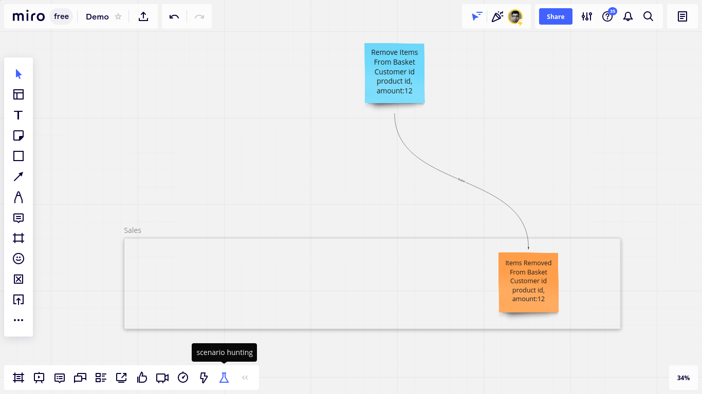
Notice that the name of the messages (like `Remove items from basket`) is separated from the fields of the message (like `customer id, product id, amount`), and the fields are separated by `line` or by comma (`,`).

As you see it's going to lead us to reverse narrate the test scenario we want to hunt without losing our focus on the model. 

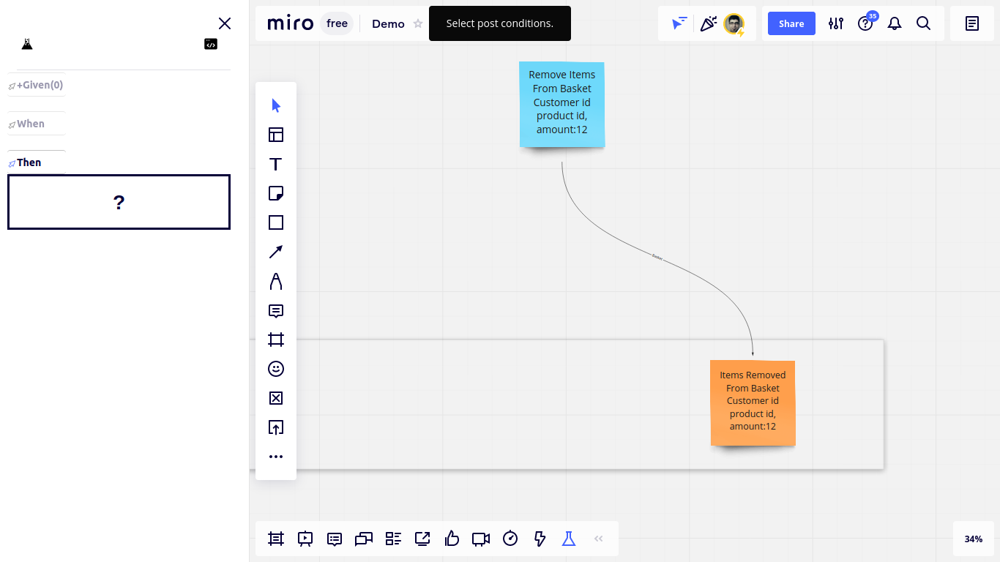

It asks us to select the "Then" step of the test. Let's select it. 

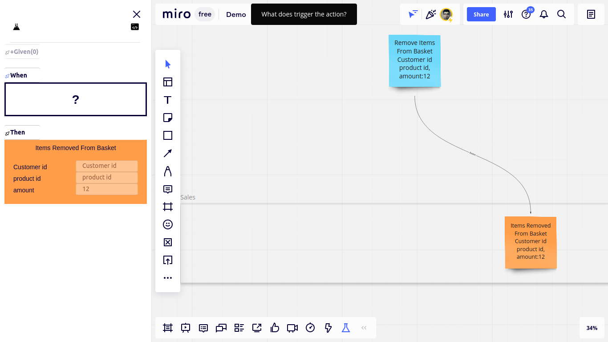

Then select the "When" step

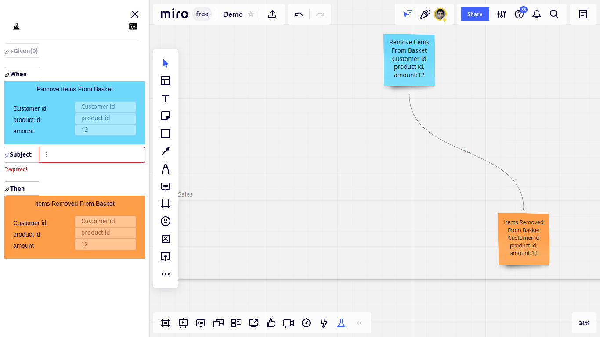

And the system under test, or in short the "Subject"

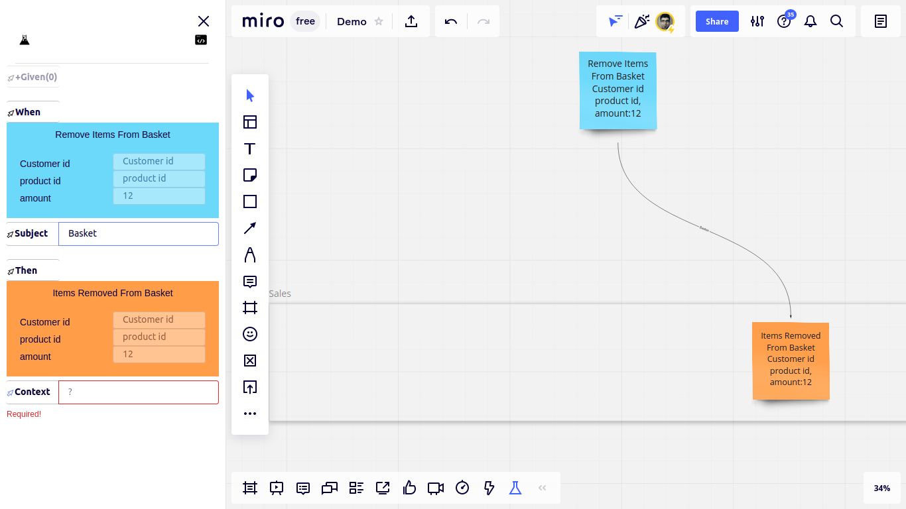

And let's select or type the "Context" (the context in which the test scenario is meaningful)

And now we have enough data to be able to name the scenario. Let's type a name for it. 

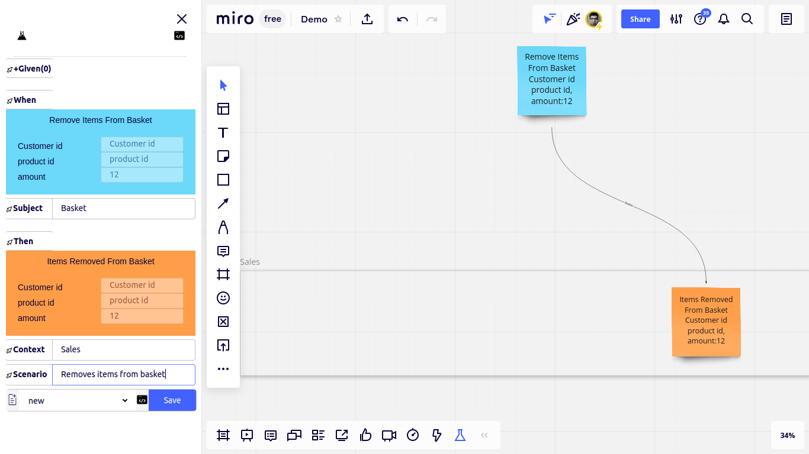

Now let's select a template that generates `C#` aggregate test code. (More on templates later)

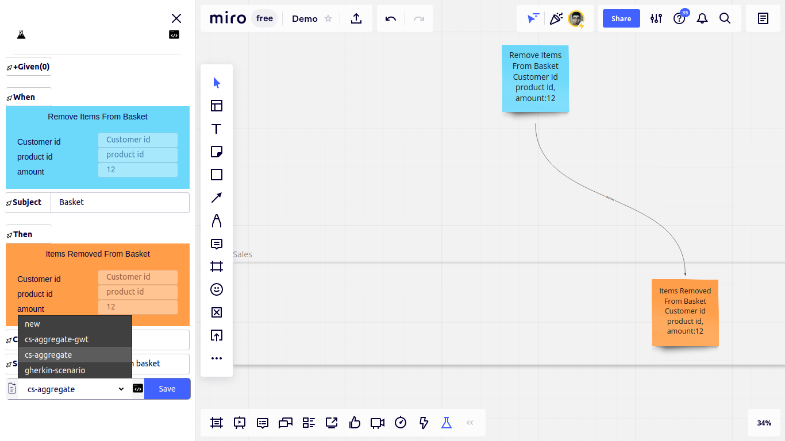

Now we can check if the "When" step provides enough data to the subject to enable it to calculate the expected "Then" step, or some preconditions should be added to the scneario, but let's skip it for now, and save the scenario.

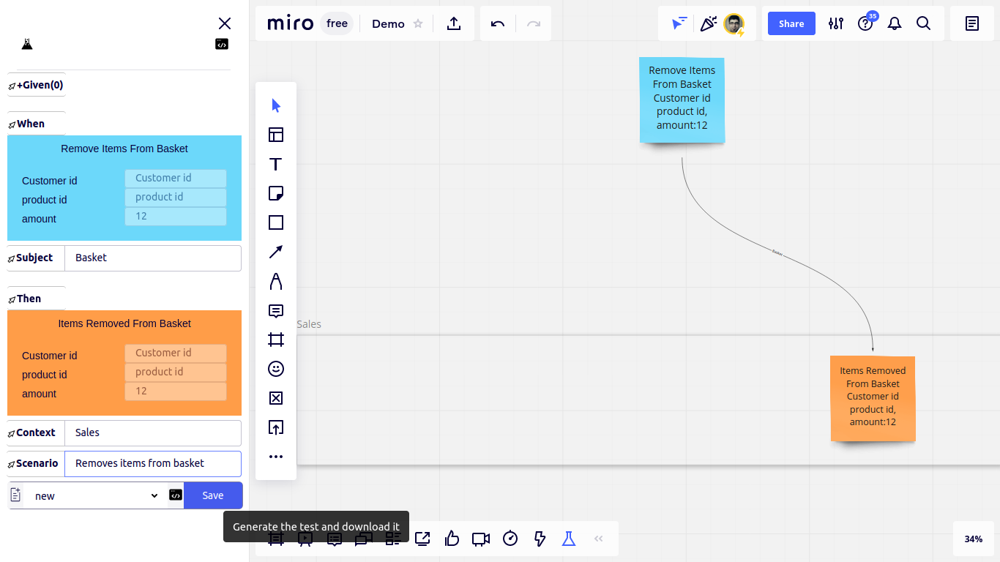

By clicking the save button the code is downloaded to the default download folder of my browser. And since I've deliberately set the download folder of this browser to my project's folder, the test code is downloaded right to the root of my project folder. So I can access the code from my IDE of choice. 
Programming language and design style are variables, and we will discuss them later.

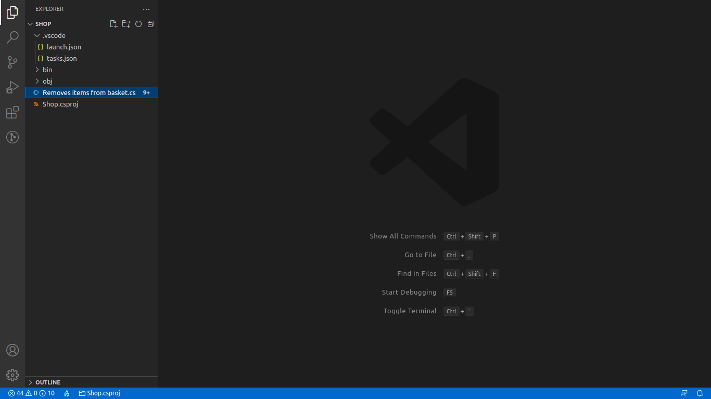

We derived the test code from the design so far. 
Now we can start to solve this exciting puzzle.
First, the build should be passed.
The compiler turns the test into a todo list for us.

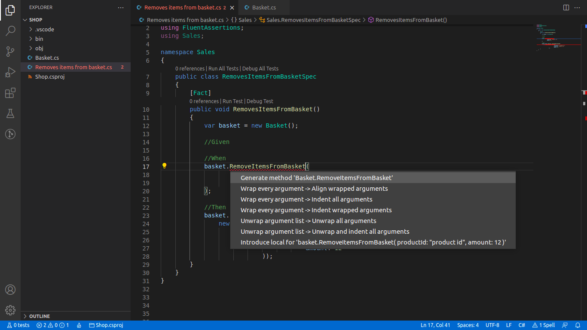

 Refactoring tools can be used to add the missing classes, methods, and functions as fast as possible.

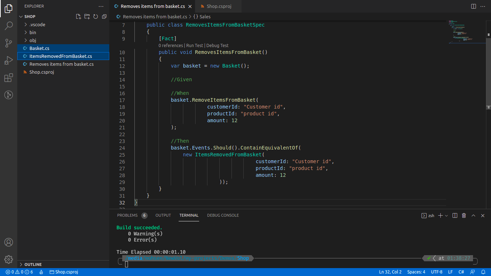

The build is passed successfully. Let's run the test, and let the failures tell us what to implement next.

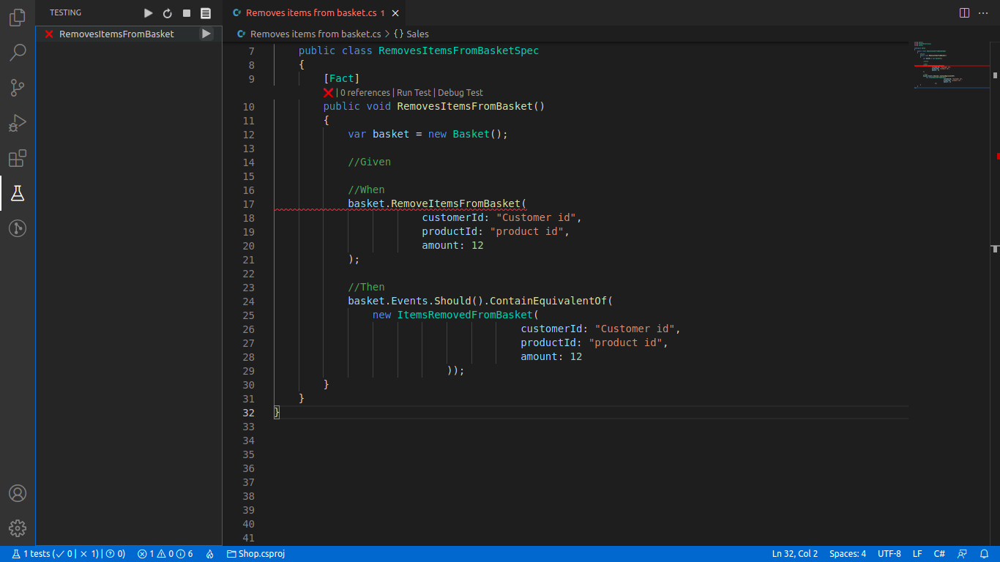

Before starting to implement, it turns out that passing `customerId` to `RemoveItemsFromBasket` is redundant, because each basket belongs only to a single customer. So let's remove this parameter.

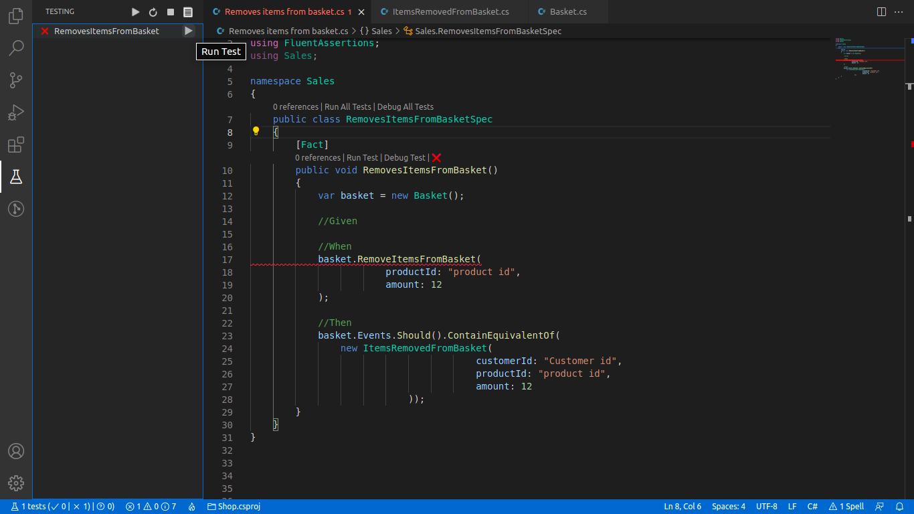

But should it be removed from the board too? 
No! Because the command handler needs it to fetch basket aggregates from repository before removing items from them.

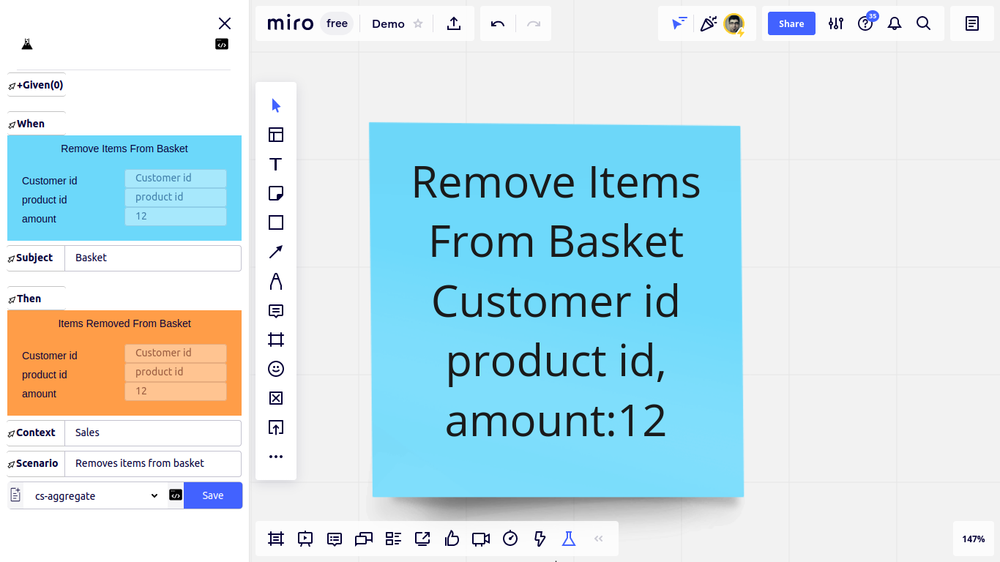

That a field is removed from code, but not from the board, is another indicator that a precondition is missing. But let's ignore it for now, and implement the test.

