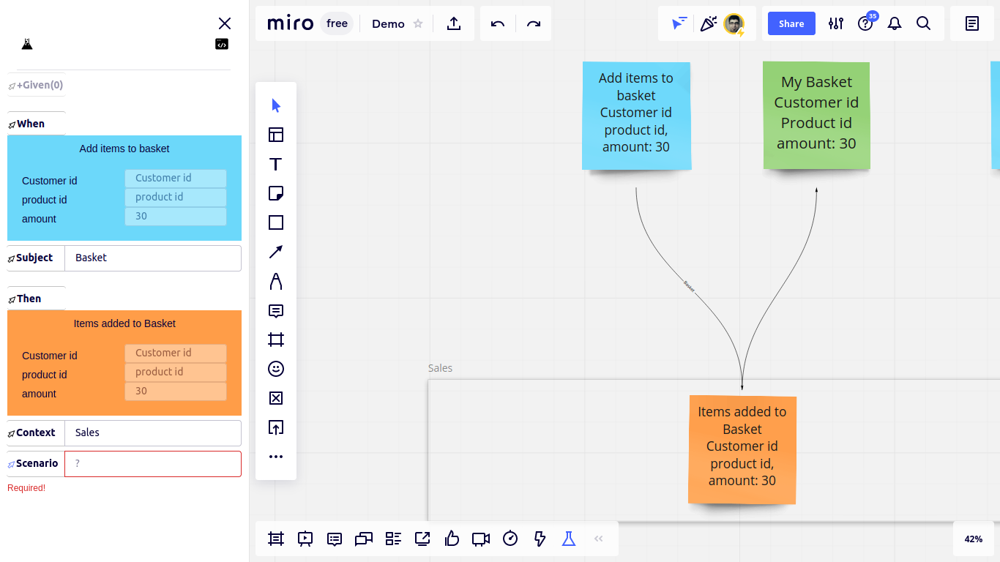

## Hunting a Simple Scenario
After the [installation](content/Quick-Start/Installation.md), let's follow this visual guide and hunt, and implement a simple scenario. 

Open the board that the addon is installed on, and add the following model.
<!-- tabs:start -->
<!-- tab:Event Storming -->

<!-- tab:Event Modeling -->

<!-- tabs:end -->
Notice that the name of the messages (like `Add items to basket`) are separated from their body (like `customer id`, `product id`, and `amount`), are separated by `new line`, and inside of message bodies the fields are separated by `new line` or by `,`.

Let's click the Scenario Hunting icon. 

<!-- tabs:start -->
<!-- tab:Event Storming -->

<!-- tab:Event Modeling -->

<!-- tabs:end -->

The addon is going to lead us to reverse narrate the test scenario we want to hunt, without making us losing our concentration on the design. 

<!-- tabs:start -->
<!-- tab:Event Storming -->

<!-- tab:Event Modeling -->

<!-- tabs:end -->

It asks us to select the "Then" step of the test. Let's select it. 

<!-- tabs:start -->
<!-- tab:Event Storming -->

<!-- tab:Event Modeling -->

<!-- tabs:end -->

Then select the "When" step

<!-- tabs:start -->
<!-- tab:Event Storming -->

<!-- tab:Event Modeling -->

<!-- tabs:end -->

And the system under test, or in short the "Subject"

<!-- tabs:start -->
<!-- tab:Event Storming -->

<!-- tab:Event Modeling -->

<!-- tabs:end -->

It's time to  select or type the "Context" (the library, service, bounded context, or application in which the test scenario is meaningful)

<!-- tabs:start -->
<!-- tab:Event Storming -->

<!-- tab:Event Modeling -->

<!-- tabs:end -->

And now we have enough data to be able to name the scenario. Let's type a name for it. 

<!-- tabs:start -->
<!-- tab:Event Storming -->

<!-- tab:Event Modeling -->

<!-- tabs:end -->

Now we can check if the "When" step provides enough data to the subject to enable it to calculate the expected "Then" step, or some preconditions should be added to the scenario. 

Before selecting each precondition the `+Given` button should be clicked.

The scenario abstraction is ready. It's the time to generate the concrete test code.

## Generating The Test Code

Now let's select a template that generates `C#` aggregate test code. (More on templates later)

<!-- tabs:start -->
<!-- tab:Event Storming -->

<!-- tab:Event Modeling -->

<!-- tabs:end -->

Let's save the scenario.

<!-- tabs:start -->
<!-- tab:Event Storming -->

<!-- tab:Event Modeling -->

<!-- tabs:end -->

By clicking the save button the code is downloaded to the default download folder of my browser. And since I've deliberately set the download folder of this browser to my project's folder, the test code is downloaded right to the root of my project folder. So I can access the code from my IDE of choice. 

!> The test can be generated for programming language, paradigm, and design style you need. More on this later.

We derived the test code from the design so far. 
Now we can start to solve this exciting puzzle.
First, the build should be passed.
The compiler turns the test into a todo list for us.

 Refactoring tools can be used to add the missing classes, methods, and functions as fast as possible.

Missing classes and methods are added. The build must succeed now.

The build succeeded. Let's run the test, and let the failures guide us what to implement next!

And after the implementation the test passes successfully.

## How Does It work?

To simplify it, It's like the MVC pattern.
- The data included in the hunted scenario is like an MVC model. 
- The template we selected is like an MVC view. 

In MVC pattern the view engine applies the model to the view, and outputs the code that can be interpreted by clients. And in scenario hunting, the template engine applies the model of the hunted scenario to the template, and outputs the test code.

## Why Is Scenario Hunting Important?
 Relying on our memory for translating the model to code, getting our minds busy by translating the scenario to test code, worrying too much about coding standards, and design style, switching back and forth between the board and the IDE, gradually shift our attention from high level design goals to relatively trivial low level technical details. 
 
 Usually, when the model is clean, common code patterns appear in different tests, they can be formalized as templates, this technique also helps to think better about the design. Anyway, test code can be generated automatically. And since the test code is an executable behavioral specification, it cuts down the cost of losing the track of higher level story. 
 
 The implementation speed is the secret of awareness of the role of the scenario under implementation, and it's effect on high level design goals.

## Conclusion

Hunting and implementing a scenario is straightforward and fast. In addition to development speed, the test code is derived directly from the model, so it's a high quality test. A high quality test leads developers to a high quality implementation. The technique can be used for spiking, and it's quality is high enough to be merged into stable production branches when the outcome is satisfactory.

You can create templates for your needs.

## Related Topics
- [installation](content/Quick-Start/Installation/article.md)

